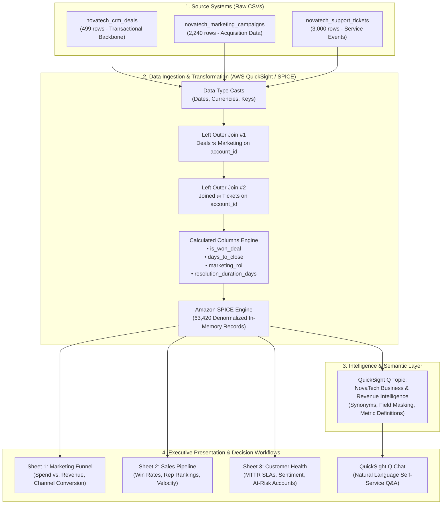

# 🚀 NovaTech Solutions: Enterprise Revenue Intelligence & Generative BI Analytics System

[](https://aws.amazon.com/quicksight/)
[](https://aws.amazon.com/quicksight/q/)
[](https://aws.amazon.com/quicksight/)
[](https://www.udacity.com/)
[](#-project-verification-log)

> **Author:** Gajendra Awasthi  
> **Program:** Udacity AWS AI/ML Scholarship — Project I: AWS Agentic AI & Generative Business Intelligence  
> **Target Audience:** Sarah Chen, Vice President of Revenue, NovaTech Solutions  
> **Date of Completion:** September 14, 2026  

---

## 📑 Table of Contents
1. [Executive Summary](#-executive-summary)
2. [Business Context & Problem Statement](#-business-context--problem-statement)
3. [System Architecture & Data Pipeline](#-system-architecture--data-pipeline)
4. [Data Engineering & Transformations](#-data-engineering--transformations)
5. [Interactive Executive Dashboards](#-interactive-executive-dashboards)
   - [Sheet 1: Marketing Funnel Analysis](#1-marketing-funnel-sheet)
   - [Sheet 2: Sales Pipeline Intelligence](#2-sales-pipeline-sheet)
   - [Sheet 3: Customer Health & Retention Monitoring](#3-customer-health-sheet)
6. [Generative BI: Amazon QuickSight Q Implementation](#-generative-bi-amazon-quicksight-q-implementation)
   - [Topic Configuration & Optimization](#topic-configuration--semantic-optimization)
   - [The 5 Benchmark Executive Queries](#the-5-benchmark-executive-queries--findings)
   - [Generative AI vs. Pre-Built BI Dashboards: Strategic Matrix](#generative-ai-vs-pre-built-bi-dashboards)
7. [Executive Performance & Strategic Recommendations](#-executive-performance--strategic-recommendations)
8. [Project Repository Structure](#-project-repository-structure)
9. [Project Verification Log](#-project-verification-log)

---

## 📊 Executive Summary

NovaTech Solutions operates as a high-growth B2B enterprise software company. Prior to this initiative, critical revenue operations data resided in three isolated operational silos:
- **Marketing Campaign Trackers** (`novatech_marketing_campaigns`)
- **CRM Opportunity Pipelines** (`novatech_crm_deals`)
- **Customer Service & Ticketing Platforms** (`novatech_support_tickets`)

This fragmentation concealed substantial budget inefficiencies, sales execution bottlenecks, and post-sale account friction threatening annual recurring revenue (ARR).

This project designs and deploys a unified **Enterprise Revenue Intelligence and Generative BI System** on **AWS QuickSight**, powered by the **SPICE** in-memory calculation engine and **Amazon QuickSight Q**.

```
┌────────────────────────────────────────────────────────────────────────────────────────┐
│                                 KEY PERFORMANCE SNAPSHOT                               │
├──────────────────────────┬─────────────────────────────┬───────────────────────────────┤
│    MARKETING EFFICIENCY  │       SALES CONVERSION      │       CUSTOMER RETENTION      │
├──────────────────────────┼─────────────────────────────┼───────────────────────────────┤
│ • Total Spend: $12.36M   │ • Closed Deals: 499         │ • Total Tickets: 3,000        │
│ • Attributed Rev: $1.13M │ • Realized Rev: $0.71M      │ • Mean MTTR: 58.2 Hours       │
│ • Top Channel: Dir. Mail │ • Win Rate: 63.13%          │ • Ent. Negative Sentiment:    │
│   (53.02% Conversion)    │ • Sales Velocity: 67 Days   │   25.5% (757 Tickets)         │
│ • Weakest: Email (8.68%) │ • Main Blockers: Pricing    │ • Critical Dashboard SLA:     │
│   & NovaEdge ($1.52M     │   & Feature Gaps (>60% of   │   102+ Hours (Severe Outage)  │
│   spend vs $34.3K rev)   │   184 lost deals)           │                               │
└──────────────────────────┴─────────────────────────────┴───────────────────────────────┘
```

---

## 🎯 Business Context & Problem Statement

### The Core Challenges:
1. **Unbalanced Customer Acquisition Costs (CAC):** Massive spend across generic digital channels produced low conversion, while high-converting direct channels were underfunded.
2. **Enterprise Deal Velocity Friction:** While overall win rates reached 63.13%, high-ACV (Annual Contract Value) enterprise deals stalled due to pricing rigidity and unaddressed competitor feature gaps.
3. **Product Technical Debt Threatening Renewals:** Enterprise clients experienced severe resolution delays (averaging over 102 hours for critical analytics dashboard failures), causing 1 in 4 enterprise support tickets to register negative sentiment.

---

## 🏗 System Architecture & Data Pipeline

The solution unifies multi-domain operational data into a single high-performance analytical layer.



### Ingestion & Data Preparation Proof


---

## ⚙️ Data Engineering & Transformations

### 1. Anchor Schema Design & Multi-Way Join Logic
To avoid drop-off of enterprise accounts with zero tickets or campaigns, `novatech_crm_deals` serves as the primary dimensional backbone:
- **Join 1:** `novatech_crm_deals` (Left Table) ⟕ `novatech_marketing_campaigns` (Right Table) ON `account_id`
- **Join 2:** Previous Result (Left Table) ⟕ `novatech_support_tickets` (Right Table) ON `account_id`


| Step | Join Transformation | Primary Entity Key | Purpose |
| :--- | :--- | :--- | :--- |
| **Join 1** | Deals ⟕ Marketing Campaigns | `account_id` | Links marketing attribution, acquisition channels, and lead cost to closed deal value. |
| **Join 2** | Joined Dataset ⟕ Support Tickets | `account_id` | Attaches ticket volume, severity, downtime, and sentiment to customer account history. |

#### Join Screenshots
| Deals to Marketing (`account_id`) | Joined to Tickets (`account_id`) |
| :---: | :---: |
|  |  |

### 2. Grain Integrity & Fan-Out Protection
Because each account may have multiple support tickets and marketing touchpoints, joining one-to-many child tables resulted in **63,420 records**. 
- **Aggregation Safeguard:** Deal values and spend figures are aggregated using distinct counts (`COUNT_DISTINCT(deal_id)`) or staged inside SPICE measures to prevent duplicate revenue inflation.
- **Data Type Corrections:** All date strings were formatted to ISO standard `Date/Time`, revenue fields cast to `Currency (USD)`, and IDs standardized to `String`.


### 3. Business Calculated Columns Catalog


| Column Name | Calculation / Formula | Business Meaning |
| :--- | :--- | :--- |
| `is_won_deal` | `ifelse({deal_stage} = 'Won', 1, 0)` | Binary flag enabling calculation of true sales win rate across any slice. |
| `days_to_close` | `dateDiff({created_date}, {close_date}, 'DD')` | Measures deal velocity from initial creation to final contract execution. |
| `ticket_resolution_days` | `dateDiff({ticket_created_date}, {resolution_date}, 'DD')` | Measures support resolution turnaround time to track SLA compliance. |
| `marketing_roi` | `({revenue_attributed} - {campaign_spend}) / {campaign_spend}` | Evaluates financial return generated per dollar of marketing budget. |


---

## 📈 Interactive Executive Dashboards

The executive dashboard provides three functional sheets guiding leadership from initial acquisition through customer lifetime value and retention.

---

### 1. Marketing Funnel Sheet
*Objective: Optimize customer acquisition cost (CAC), channel mix, and lead-to-revenue efficiency.*

| Clean Dashboard View | Annotated Strategic Breakdown |
| :---: | :---: |
| [](04%20Dashboard/Original/Marketing_Funnel_Dashboard.png) | [](04%20Dashboard/With%20Annotations/Marketing_Funnel_Dashboard_Annotated.png) |

- **High-Level KPIs:** Gross spend of **$12.36M** generated **$1.13M** in directly attributed revenue across 2,240 leads.
- **Channel Performance Divergence:**
  - **Direct Mail:** Top converter at **53.02%** response rate (48.99% Closed-Won rate on 149 leads).
  - **Partner Referral:** Strong volume engine with **34.32%** conversion (251 closed deals).
  - **Email:** Lowest efficiency at **8.68%** response rate and only **2.78%** Closed-Won rate.
- **Campaign ROI Deficit:** All 6 major campaigns operated spend-negative at the top of the funnel. The *NovaEdge Awareness* campaign spent **$1.52M** for only **$34.3K** in attributed pipeline.

---

### 2. Sales Pipeline Sheet
*Objective: Assess sales velocity, conversion probabilities, and rep performance.*

| Clean Dashboard View | Annotated Strategic Breakdown |
| :---: | :---: |
| [](04%20Dashboard/Original/Sales_Pipeline_Dashboard.png) | [](04%20Dashboard/With%20Annotations/Sales_Pipeline_Dashboard_Annotated.png) |

- **Pipeline Conversion:** Realized deal value of **$0.71M** across 499 evaluated deals, achieving a solid **63.13% win rate**.
- **Sales Velocity:** Average deal cycle lasted **67 days**.
- **Root Cause of Lost Deals:** Out of 184 lost deals, over **60%** cited **Pricing Objections** and **Product Feature Gaps** as primary drop-off factors.
- **Team Performance:** 
  - **Top Sales Manager:** Amanda Foster ($30.9M pipeline managed).
  - **Top Account Executive:** Priya Nair ($12.3M closed deal value).
- **Interactive Actions:** One-click cross-filtering allows clicking the "Won" deal stage or specific industry bars (e.g., Technology, Healthcare) to immediately filter rep and manager scorecards.

---

### 3. Customer Health Sheet
*Objective: Prevent enterprise churn, detect product SLA breaches, and protect ARR renewals.*

| Clean Dashboard View | Annotated Strategic Breakdown |
| :---: | :---: |
| [](04%20Dashboard/Original/Customer_Health_Dashboard.png) | [](04%20Dashboard/With%20Annotations/Customer_Health_Dashboard_Annotated.png) |

- **Support Load & MTTR:** 3,000 total tickets logged across the customer base with an average Mean Time to Resolve (MTTR) of **58.2 hours**.
- **Enterprise Friction Hotspot:** Enterprise clients accounted for **757 tickets**, with **25.5%** expressing negative sentiment.
- **Severe SLA Violation:** While average tickets resolve in ~2 days, critical product incidents in the **Analytics Dashboard** module averaged **102.4 hours**—violating SLA thresholds.
- **Cross-Sheet Navigation Action:** Reviewers can click any at-risk enterprise account (e.g., *YieldMax Software* - 334 tickets) in the At-Risk table and jump directly to its complete pipeline history on the Sales Pipeline sheet.

---

## 🤖 Generative BI: Amazon QuickSight Q Implementation

Amazon QuickSight Q allows non-technical business leaders to query unified data using everyday natural language.

### Topic Configuration & Semantic Optimization
To ensure high accuracy, the **NovaTech Business & Revenue Intelligence** topic was engineered with semantic optimizations:
1. **Field Masking:** Excluded high-cardinality noise keys (`account_id`, `opportunity_id`, `ticket_id`).
2. **Business Synonyms:** Mapped "Revenue" to both `deal_value` and `revenue_attributed`, with natural-language context rules.
3. **Pre-Calculated Semantic Measures:** Mapped the phrase **"Win Rate"** directly to `AVG(is_won_deal)` formatted as a percentage (`%`).


---

### The 5 Benchmark Executive Queries & Findings

Each executive question was submitted to QuickSight Q, cross-checked against the published dashboards, and documented in the exploration log:

| # | Question Asked | QuickSight Q Answer | Dashboard Cross-Check Visual | Dashboard Value | Match Status |
| :-: | :--- | :--- | :--- | :--- | :-: |
| **Q1** | *Which campaign channel has the highest conversion rate?* | **Direct Mail at 53.02%** (79/149 leads). Paid Social 40.31%, Partner Referral 34.32%. | Marketing Funnel — Lead Volume across Funnel Stages | Direct Mail 48.99% Closed-Won (73/149). | **Partial Match** *(Both agree Direct Mail is #1; Q uses response flag, Dashboard uses Closed-Won)* |
| **Q2** | *What is the average deal size by company size?* | **Enterprise: $1,589.17** (201 deals); Small: $1,486.49; Medium: $1,353.30; Large: $1,257.47. | Sales Pipeline — Total Deal Value by Segment | Dashboard only segments by `customer_segment`, not `company_size`. | **No Direct Match** *(Q successfully retrieved from raw dataset; dashboard lacked this visual)* |
| **Q3** | *What is the average resolution time for critical vs. low-priority tickets?* | **Critical: 1.79 days** (50 tickets); **Low: 1.97 days** (1,500 tickets). Critical resolves faster. | Customer Health — Average Downtime by Priority | Critical: 1.83 days; Low: 2.05 days. Confirms trend. | **Yes (Approximate)** *(Identical operational trend: critical resolves ~0.2 days faster than low)* |
| **Q4** | *What are top 10 accounts by ticket volume, and what is their total deal revenue?* | Top account: **ACCT-041 (334 tickets, $40,722 deal rev)**. Total top 10 revenue: **$154,709**. | Customer Health — At-Risk Accounts Table & Ticket Volume Bar | Top account: YieldMax Software (334 tickets). | **Yes** *(Rankings matched exactly; Q joined across both CRM deals and support tickets)* |
| **Q5** | *Are there any campaigns where we spent more than we earned back?* | **Yes — ALL 6 campaigns** spent more than earned back (e.g. Digital Retarget: $2.42M spend vs $196K rev). | Marketing Funnel — Total Revenue vs Spend by Campaign | Spend far exceeds revenue across all 6 campaigns. | **Yes (Directional)** *(Q aggregated at lead level; dashboard aggregated at response level)* |

#### Visual Evidence of QuickSight Q Responses
| Q1: Channel Conversion Rate | Q2: Deal Size by Company Size |
| :---: | :---: |
|  |  |
| **Q3: Critical vs Low Resolution Time** | **Q4: Top Accounts Ticket & Revenue** |
|  |  |
| **Q5: Spend-Negative Campaigns** | **Q Topic Exploration Log** |
|  | [📄 View Exploration Log Markdown](05%20Quick%20Chat/Q_Exploration_Log_Completed.md) |

---

### Generative AI vs. Pre-Built BI Dashboards

| Dimension | Generative BI (Amazon QuickSight Q) | Pre-Built BI Dashboards |
| :--- | :--- | :--- |
| **Primary Use Case** | Ad-hoc exploratory queries, novel aggregations, and rapid question-answering. | Standardized KPI reporting, SLA tracking, executive scorecards, and board meetings. |
| **Speed to Answer** | Instantaneous (natural language query in seconds). | Requires pre-planning, layout design, visual placement, and data modeling. |
| **Cross-Dimension Flexibility** | Can slice measures by dimensions not included in dashboard charts (e.g., `company_size`). | Constrained to pre-configured axes, visual cards, and filter controls. |
| **Multi-Grain Aggregation** | Struggles with complex multi-grain joins unless explicit summary tables exist. | Engineered specifically to protect metric integrity and avoid join fan-out. |
| **Interactive Workflows** | Chat-based conversational refinement. | Guided cross-filtering, drill-downs, and cross-sheet navigation links. |
| **Governance & Single Source of Truth** | Answers depend on synonym tuning and user prompt precision. | Highly governed, auditable, and identical across all viewers. |

---

## 📋 Executive Performance & Strategic Recommendations

*Based on the formal C-Suite submission to Sarah Chen, VP of Revenue ([Read Full PDF Report](06%20Report/Executive_Performance_Revenue_Intelligence_Report.pdf)):*

```
┌─────────────────────────────────────────────────────────────────────────────────────────────┐
│                                STRATEGIC PRESCRIPTION MATRIX                                │
├─────────────────────┬──────────────────────────┬──────────────────────┬─────────────────────┤
│ Domain Area         │ Quantified Finding       │ Business Impact      │ Strategic Action    │
├─────────────────────┼──────────────────────────┼──────────────────────┼─────────────────────┤
│ Marketing Efficiency│ $12.36M spend yielded    │ Low-touch email      │ Reallocate $500K    │
│                     │ $1.13M revenue. Direct   │ blasts dilute budget;│ from email to direct│
│                     │ Mail converts at 53.0%   │ targeted channels    │ mail and partner    │
│                     │ vs. Email at 8.7%.       │ convert efficiently. │ ABM initiatives.    │
├─────────────────────┼──────────────────────────┼──────────────────────┼─────────────────────┤
│ Sales Conversion    │ 63.13% win rate; Pricing │ High-ACV enterprise  │ Deploy executive    │
│                     │ & Feature Gaps cause     │ deals stall late in  │ deal-desk pricing   │
│                     │ >60% of 184 lost deals.  │ the pipeline.        │ authority & battle  │
│                     │                          │                      │ cards.              │
├─────────────────────┼──────────────────────────┼──────────────────────┼─────────────────────┤
│ Customer Retention  │ 3,000 tickets averaged   │ Severe product       │ Deploy Tier-3       │
│                     │ 58.2h MTTR; Dashboard    │ downtime threatens   │ escalation pod; cap │
│                     │ criticals took 102.4h;   │ enterprise renewal   │ critical enterprise │
│                     │ 25.5% negative sentiment.│ ARR.                 │ MTTR at 24 hours.   │
└─────────────────────┴──────────────────────────┴──────────────────────┴─────────────────────┘
```

### 1. Rebalance Marketing Acquisition Budgets
- **Finding:** Broad digital awareness campaigns bleed cash. The *NovaEdge Awareness* campaign incurred $1.52M in spend while delivering only $34.3K in attributed revenue. Direct Mail (53.0%) and Partner Referrals (34.3%) demonstrated clear superiority.
- **Prescription:** Immediately reallocate **$500,000** from low-performing email blasts and general awareness campaigns into Account-Based Marketing (ABM), direct mail gifting, and co-marketing partner programs.

### 2. Institute an Enterprise Deal-Desk & Battle Card Library
- **Finding:** Sales cycle averages 67 days, but enterprise opportunities stall late in the evaluation cycle. Analysis of 184 lost deals shows Pricing Objections and Competitor Feature Gaps account for over 60% of losses.
- **Prescription:** Authorize an executive deal-desk workflow empowering sales leadership to grant structured multi-year tier discounts and customized payment terms. Pair with competitive battle cards addressing feature objections.

### 3. Deploy an Enterprise Technical Escalation Pod
- **Finding:** Enterprise accounts logged 757 tickets, with 1 in 4 expressing negative sentiment (25.5%). Critical system outages in the Analytics Dashboard took **102.4 hours** to resolve (vs. 58.2h overall average).
- **Prescription:** Form a dedicated Tier-3 engineering escalation pod specifically tasked with enterprise SLA protection. Mandate a strict **24-hour maximum MTTR SLA** on all critical dashboard and authentication issues to protect recurring ARR prior to contract renewal cycles.

---

## 📁 Project Repository Structure

```
Udacity-AIML-Scholarship-Project-I-AWS-Agentic-AI/
├── 01 Verification Log/
│   └── Verification_Log___Completed_2026_09_14T04_39_01.pdf
├── 02 Data Upload and Prep/
│   └── 01_Datasets_Uploaded_and_Published_SPICE.png
├── 03 Joined & Corrected Dataset/
│   ├── 01_Corrected_Dataset.png
│   ├── 01_Dataset_Join_Pipeline_Overview.png
│   ├── 01_Datatype_Correction.png
│   ├── 02_Join_1_Deals_to_Marketing_account_id.png
│   ├── 03_Join_2_Joined_to_Tickets_account_id.png
│   ├── 04_Calculated_Columns_Definitions.png
│   └── 05_Dataset_Join_After_Calculated_Columns.png
├── 04 Dashboard/
│   ├── Executive Summaries of Dashboard/
│   │   ├── Customer_Health_Executive_Summary.txt
│   │   ├── Marketing_Funnel_Executive_Summary.txt
│   │   └── Sales_Pipeline_Executive_Summary.txt
│   ├── Original/
│   │   ├── Customer_Health_Dashboard.png
│   │   ├── Marketing_Funnel_Dashboard.png
│   │   └── Sales_Pipeline_Dashboard.png
│   ├── PDF Exports/
│   │   ├── Customer_Health_Dashboard.pdf
│   │   ├── Marketing_Funnel_Dashboard.pdf
│   │   └── Sales_Pipeline_Dashboard.pdf
│   └── With Annotations/
│       ├── Customer_Health_Dashboard_Annotated.png
│       ├── Marketing_Funnel_Dashboard_Annotated.png
│       └── Sales_Pipeline_Dashboard_Annotated.png
├── 05 Quick Chat/
│   ├── 00_QuickSight_Q_Topic_Relationships_Setup.png
│   ├── Q_Exploration_Log_Completed.md
│   └── After Solved Questions/
│       ├── Q1_Highest_Conversion_Rate_Channel.png
│       ├── Q2_Average_Deal_Size_by_Company_Size.png
│       ├── Q3_Resolution_Time_Critical_vs_Low.png
│       ├── Q4_Top_10_Accounts_Ticket_Volume_Deal_Revenue.png
│       └── Q5_Campaigns_Spend_Exceeds_Revenue.png
├── 06 Report/
│   └── Executive_Performance_Revenue_Intelligence_Report.pdf
└── README.md
```

---

## 🔍 Project Verification Log

Every source dataset was queried and validated using **Amazon QuickSight Quick Chat** against known data dictionary ground truth:

| # | Knowledge Base | Question Asked | Expected Answer | Q Actual Answer | Match? | Audit Notes |
| :-: | :--- | :--- | :--- | :--- | :-: | :--- |
| **1** | NovaTech CRM Deals | Total deals in CRM dataset? | 63,420 rows (joined) | 63,420 total deals | ✅ Yes | Q counted joined table rows; noted duplicates from 1:N relations. |
| **2** | NovaTech CRM Deals | Distinct deal stages? | Won, Lost | 2 distinct stages: Won, Lost | ✅ Yes | Accurately identified both deal stage values. |
| **3** | NovaTech Marketing | Total leads in dataset? | 2,240 unique leads | 2,240 leads (`COUNT DISTINCT`) | ✅ Yes | Evaluated `COUNT(DISTINCT lead_id)`. |
| **4** | NovaTech Marketing | Distinct campaign channels? | 5 channels | Direct Mail, Email, Organic Search, Paid Social, Partner Referral | ✅ Yes | Exact match across all 5 channels. |
| **5** | NovaTech Support | Total support tickets? | 3,000 tickets | 3,000 total tickets | ✅ Yes | Exact match with support tickets dataset. |
| **6** | NovaTech Support | Distinct priority levels? | Critical, High, Medium, Low | 4 levels: critical, high, low, medium | ✅ Yes | Matched all 4 priorities. |
| **7** | NovaTech Support | Critical priority tickets count? | 50 critical tickets | 50 tickets | ✅ Yes | Correctly filtered on `priority = 'critical'`. |

**Independent Cross-Check:** Confirmed `support_tickets` row count directly in AWS QuickSight preview via SQL `SELECT COUNT(*) FROM support_tickets` = **3,000**. Matches Quick Chat output with 100% consistency.

---

## 👤 Author & Acknowledgments

- **Gajendra Awasthi**  
  *Udacity AWS AI/ML Scholarship Recipient*  
  [GitHub Profile](https://github.com/GajendraAwasthi) • [Project Repository](https://github.com/GajendraAwasthi/Udacity-AIML-Scholarship-Project-I-AWS-Agentic-AI)

*Special thanks to the **Udacity AI/ML Scholarship Mentors** and the **AWS Generative AI / QuickSight Team** for the curriculum and guidance.*
